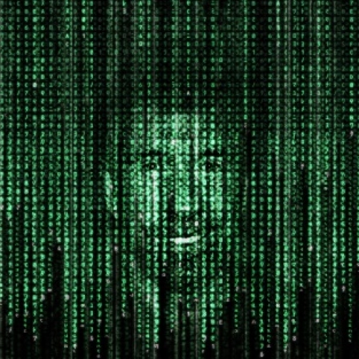
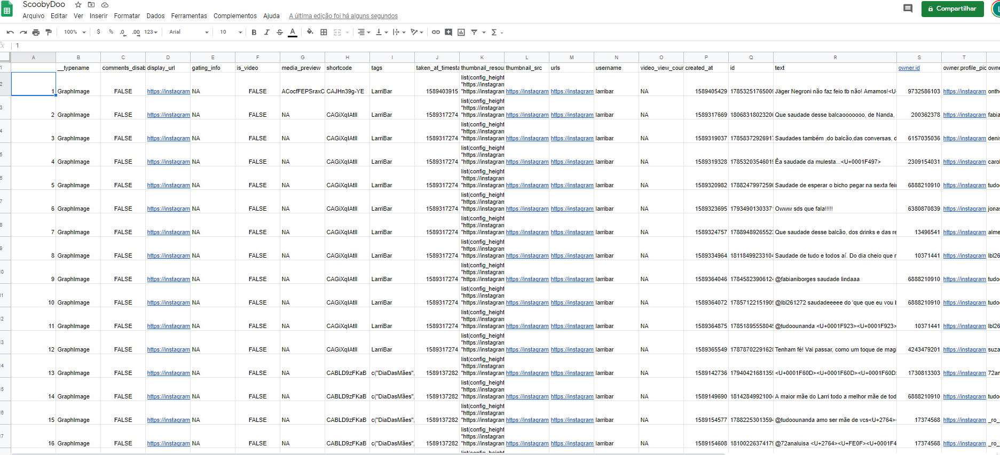
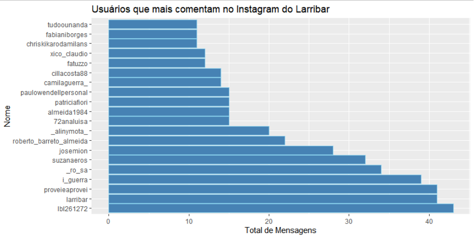
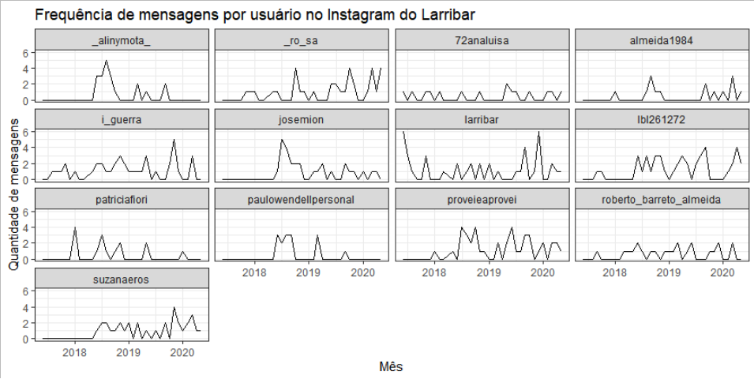
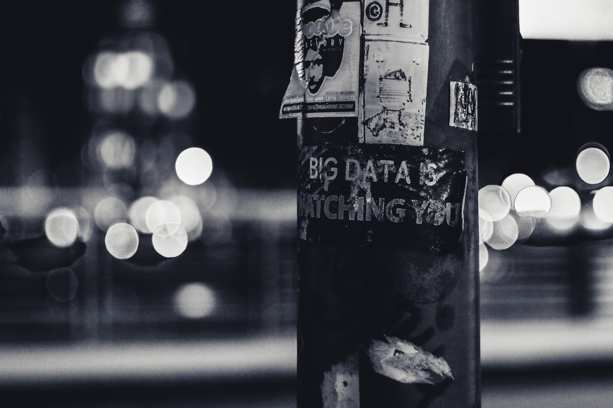
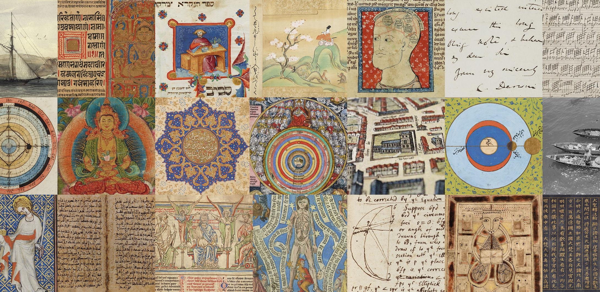

layout: true
  
<div class="my-footer"><span>

<a href="https://leofn.com">Leonardo F. Nascimento</a> - Email: <a href="mailto:leofn@ufba.br">leofn@ufba.br</a>
</span></div>


---
class: middle, center
```{r setup, include=FALSE}
options(htmltools.dir.version = FALSE)

knitr::opts_chunk$set(
	echo = FALSE,
	fig.align = "center",
	message = FALSE,
	warning = FALSE,
	cache = FALSE
)
```

```{r eval=FALSE, include=FALSE}
library(knitr)
library(tidyverse)
library(widgetframe)
```

# Leonardo F. Nascimento

```{r out.width="15%"}
knitr::include_graphics("img/logos_bia.png")
```
15% Programador, 20% Químico, 25% Psicólogo, 40% Cientista Social

[Email: **leofn3@gmail.com**](mailto:leofn3@gmail.com) 

[Twitter:**@leofn3**](http://www.twitter.com/leofn3) 

[website: **www.leofn.com**](http://www.leofn.com)

---

class: middle, center  

```{r, out.width="30%"}
knitr::include_graphics("img/logo_MA_color.png")
```

# Objetivos: 

Contribuir para a difusão de uma prática de pesquisa/ensino e extensão digitalizada; 

Propor investigações sobre os impactos no uso de tecnologias digitais; 
  
Criar repositórios de dados digitais abertos para os diversos pesquisadores; 
 
Promover a aproximação e o diálogo entre as humanidades e o campo das tecnologias.

---
class: middle, center  
# LABHDUFBA nas redes:


Twitter: [@labhdufba](https://twitter.com/labhdufba), 
  
  
Instagram: [@labhdufba](http://instagram.com/labhdufba)
  
  
Github: [https://github.com/LABHDUFBA](https://github.com/LABHDUFBA)
  
  
Youtube: [Clique aqui](https://www.youtube.com/channel/UCjUf9BsbG-C-gpA54zvOgBw)

---
class: inverse, center, middle

# Vamos começar!

---
class: middle, center

# "A digitalização do eu na vida cotidiana"

--

...novas formas de localização no espaço

--

...novas formas de buscar informações

--

...novas formas de nos relacionarmos

--

...novas formas de ler livros

--
 
...novas relações de poder, economia e sociedade

--

---
class: middle, center

## O digital como "fato social total" 

```{r, out.width="90%"}
knitr::include_graphics("img/ds.jpeg")
```

"a própria ideia de 'cultura' ou 'sociedade' não pode ser plenamente compreendida sem o reconhecimento de que os dispositivos de software e hardware constituem ativamente a individualidade, a corporeidade, a vida social, as relaçoes sociais e as instituiçoes" HORST, H. A.; MILLER, D. Digital Anthropology. Bloomsbury Academic, 2012. 

---
class: middle, center

# Rastros Digitais

```{r, out.width="50%"}

```

"as atividades on-line dos usuários deixam rastros digitais que são transformados em pontos de dados em bancos de dados, mantidos por provedores de serviços e outras organizações públicas e privadas, e reaproveitados para exploração comercial, inovação empresarial, vigilância e pesquisa". LOMBORG et alli, 2020

---
class: middle, center

# Dataficação

```{r, out.width="35%"}

```
---
class: middle, center

# Dataficação

```{r, out.width="150%"}

```

---
class: middle, center

# Dataficação

```{r, out.width="100%"}

```

---
class: middle, center

# Dataficação

```{r, out.width="100%"}

```

---
class: middle, center

# Dataficação

```{r, out.width="80%"}

```

Dataficação é a transformação da ação social em dados quantificados, permitindo assim o rastreamento em tempo real e a análise preditiva.(MAYER-SCHONBERGER & CUKIER, 2013)

---
class: middle, center

# A virada digital nas Ciências Sociais:

--

## Sociologia Digital

--

## Geografia Digital

--

## História Digital

--

## Economia Digital

--

## Ciência Social Computacional

---
class: middle, center
# A virada digital como mudança de paradigma


```{r, out.width="80%"}

```

Todas essas "correntes" ou "escolas" concordam que "novas fontes de dados e novas técnicas de armazenamento e análise de dados podem levar a uma mudança de paradigma nas ciências sociais" (JUNGHERR, 2015, p.34)
---

class: middle, center

# Da dataficação aos métodos digitais

```{r, out.width="60%"}
knitr::include_graphics("https://media0.giphy.com/media/CjmvTCZf2U3p09Cn0h/giphy-downsized.gif")
```

É possível pesquisar os fenômenos digitais sem o uso de métodos digitais de pesquisa?

---
class: middle, center
# Desafios: dados digitais 
<br>
--

## Publicidade/Acessibilidade

--

## Terceirização

--

## Evocação versus coleta

--

## Representatividade
  
--
  
## Volume, Velocidade, Variedade, Perecibilidade
  
--

## Não há isocronia

---
class: middle, center

# Desafios: ferramentas digitais
<br>
--

## Coleta/extração (webscraping, data mining) 

--

##Articulação analógico e digital

--

##Quali-quanti (Análises automatizadas x análises interpretativas)

--

## Letramento digital

--

## Caixas-pretas: open-source x proprietário

--

## Realidade virtual e aumentada 

---
class: middle, center

# Desafios: resultados
<br>
--

## Dilemas éticos

--

## Qual a capacidade pública de intervirmos ou de instruirmos atores em disputa?

--

## Qual a capacidade preditiva das análises?

--

## Como avaliar os efeitos das diferentes arquiteturas algorítmicas?

--

## Como tratar das dimensões da experiências que escapam à dataficação?

---
class: middle, center

# Fetichismos dos dados, dos métodos e dos resultados
<br>
--

Coletar mais dados e de uma diversidade de fontes garantiria per se uma pesquisa necessariamente melhor **FALSO**

Utilizar uma diversidade de métodos digitais garantiria per se uma pesquisa necessariamente melhor **FALSO**

Os resultados das pesquisas baseadas em dados digitais e métodos digitais são necessariamente melhores e/ou superiores às pesquisas analógicas tradicionais **FALSO**

---
class: middle, center

# Vamos andar de bicicletas?

```{r, out.width="60%"}
knitr::include_graphics("https://media.giphy.com/media/xTiTnAUgTbDrsUiHja/giphy.gif")
```

---
class: middle, center

# Vamos andar de bicicletas?
<br>
--

Percepção da utilidade; 

--

Aprendizado inicial; 

--

Aperfeiçoamento do uso; 

--

Diversificação/especialização; 

--

Criação

---


class: middle

# Referências

HORST, H. A.; MILLER, D. Digital Anthropology. Bloomsbury Academic, 2012.

JUNGHERR, A. Analyzing Political Communication with Digital Trace Data: The Role of Twitter Messages in Social Science Research. Springer, 2015. 

LOMBORG, S.; DENCIK, L.; MOE, H. Methods for Datafication, Datafication of Methods: Introduction to the Special Issue. European Journal of Communication, p. 0267323120922045, Acesso em: 5 maio 2020. 

---
class:  middle

## Obrigado gente!
.pull-left[
```{r, out.width="100%"}
knitr::include_graphics("https://media1.giphy.com/media/3oz8xIsloV7zOmt81G/giphy.gif")
```
]

.pull-right[
**Agradecimentos especiais**:
- Prof. Israel - Pelo convite!
- [Tarssio](https://github.com/tarssioesa) - Pelas dicas no script em R para o Larribar
- [Beatriz Milz do R-Ladies](https://github.com/beatrizmilz/IME-27-08-2019) - De quem eu "garfei" esta apresentação e modifiquei]

---
# Leonardo F. Nascimento

```{r out.width="15%"}
knitr::include_graphics("img/logos_bia.png")
```
15% Programador, 20% Químico, 25% Psicólogo, 40% Cientista Social

[Email: **leofn3@gmail.com**](mailto:leofn3@gmail.com) 

[Twitter:**@leofn3**](http://www.twitter.com/leofn3) 

[website: **www.leofn.com**](http://www.leofn.com)

---


