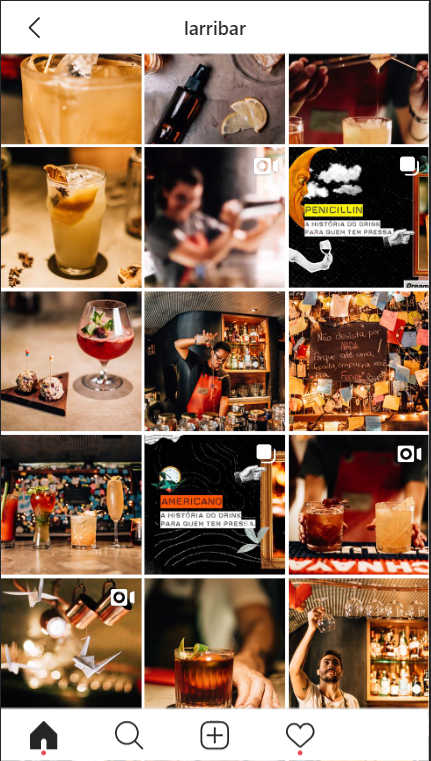

layout: true
  
<div class="my-footer"><span>

<a href="https://leofn.com">Leonardo F. Nascimento</a> - Email: <a href="mailto:leofn@ufba.br">leofn@ufba.br</a>
</span></div>


---
class: middle
```{r setup, include=FALSE}
options(htmltools.dir.version = FALSE)

knitr::opts_chunk$set(
	echo = FALSE,
	fig.align = "center",
	message = FALSE,
	warning = FALSE,
	cache = FALSE
)
```

```{r eval=FALSE, include=FALSE}
library(knitr)
library(tidyverse)
library(widgetframe)
```

# Leonardo F. Nascimento

```{r out.width="15%"}
knitr::include_graphics("img/logos_bia.png")
```
- 15% Programador, 20% Químico, 25% Psicólogo, 40% Cientista Social

- [Email: **leofn3@gmail.com**](mailto:leofn3@gmail.com) 

- [Twitter:**@leofn3**](http://www.twitter.com/leofn3) 

- [website: **www.leofn.com**](http://www.leofn.com)


---

class:  

```{r, out.width="20%"}

```

- Objetivos: 
  - contribuir para a difusão de uma prática de pesquisa/ensino e extensão digitalizada; 
  
  - propor investigações sobre os impactos no uso de tecnologias digitais; 
  
  - criar repositórios de dados digitais abertos para os diversos pesquisadores; 
  
  - promover a aproximação e o diálogo entre as humanidades e o campo das tecnologias.

---

# LABHDUFBA nas redes:


  - Twitter: [@labhdufba](https://twitter.com/labhdufba), 
  
  
  - Instagram: [@labhdufba](http://instagram.com/labhdufba)
  
  
  - Github: [https://github.com/LABHDUFBA](https://github.com/LABHDUFBA)
  
  
  - Youtube: [Clique aqui](https://www.youtube.com/channel/UCjUf9BsbG-C-gpA54zvOgBw)

---
class: inverse, center, middle

# Vamos começar!

---
class: middle

# "A digitalização do eu na vida cotidiana"

--

- ...novas formas de localização no espaço

--

- ...novas formas de buscar informações

--

- ...novas formas de nos relacionarmos

--

- ...novas formas de ler livros

--
 
- ...novas relações de poder, economia e sociedade

--

---
class:middle

## O digital como "fato social total" 

```{r, out.width="90%"}
knitr::include_graphics("img/ds.jpeg")
```

"a própria ideia de 'cultura' ou 'sociedade' não pode ser plenamente compreendida sem o reconhecimento de que os dispositivos de software e hardware constituem ativamente a individualidade, a corporeidade, a vida social, as relaçoes sociais e as instituiçoes" HORST, H. A.; MILLER, D. Digital Anthropology. Bloomsbury Academic, 2012. 

---
class: middle

# Rastros Digitais

```{r, out.width="50%"}
knitr::include_graphics("img/datafication.jpg")
```

"as atividades on-line dos usuários deixam rastros digitais que são transformados em pontos de dados em bancos de dados, mantidos por provedores de serviços e outras organizações públicas e privadas, e reaproveitados para exploração comercial, inovação empresarial, vigilância e pesquisa". LOMBORG et alli, 2020

---

# Dataficação

```{r, out.width="35%"}

```
---
# Dataficação

```{r, out.width="150%"}
knitr::include_graphics("img/larribar4.png")
```

---
# Dataficação

```{r, out.width="100%"}
knitr::include_graphics("img/larribar1.png")
```

---
# Dataficação

```{r, out.width="100%"}

```

---
# Dataficação

```{r, out.width="80%"}
knitr::include_graphics("img/datafication3.jpg")
```

Dataficação é a transformação da ação social em dados quantificados, permitindo assim o rastreamento em tempo real e a análise preditiva.(MAYER-SCHONBERGER & CUKIER, 2013)

---
class: middle

# A virada digital nas Ciências Sociais:

--

- Sociologia Digital

--

- Geografia Digital

--

- História Digital

--

- Economia Digital

--

- Ciência Social Computacional

---

# A virada digital como mudança de paradigma


```{r, out.width="80%"}
knitr::include_graphics("img/dh.jpg")
```

Todas essas "correntes" ou "escolas" concordam que "novas fontes de dados e novas técnicas de armazenamento e análise de dados podem levar a uma mudança de paradigma nas ciências sociais" (JUNGHERR, 2015, p.34)


class: middle

# Pacote rmarkdown

```{r, out.width="60%", fig.cap="<center><b>Fonte: <a href='https://rmarkdown.rstudio.com'>Pacote Rmarkdown</a></b></center>"}
knitr::include_graphics("img/RMarkdownOutputFormats.png")
```


---
class: middle

# Pacote xaringan

```{r, out.width="30%", fig.cap="<center><b>Logo: <a href='https://github.com/yihui/xaringan'>Pacote xaringan</a></b></center>"}
knitr::include_graphics("img/rlogos/hex-xaringan.png")
```

- Possibilita criar apresentações **ninja** com `RMarkdown`

- Utiliza a biblioteca `remark.js`

- Resultado em HTML (mas também PDF - estático)


---
class: middle

# Como usar o xaringan?
- Instalar o pacote:

```{r echo=TRUE, eval=FALSE}
install.packages("xaringan")
```

- Criar um novo RProj (post da [Curso-R](https://www.curso-r.com): sobre [RProj e diretórios](https://www.curso-r.com/blog/2019-07-16-zen-do-r-3/))
  - File > New Project

- Criar um arquivo:
  - File > New File > R Markdown...
  - New RMarkdown > From Template > Ninja presentation
  
- Apagar todo o conteúdo após o código `yaml`
---
class: middle

# Estrutura do .Rmd

```{r out.width="100%"}
knitr::include_graphics("img/rmd-estrutura.png")
```

---
class: middle

# Dicas .Rmd

```{r out.width="100%"}
knitr::include_graphics("img/rmd-dicas.png")
```

---
class: middle

# Estrutura da apresentação

- No `xaringan`, utilizamos o arquivo `.Rmd` para escrever o código da apresentação, e é compilado para um arquivo `.html`.

- Esse arquivo `.html` é interpretado pelo navegador (ex. Chrome), utilizando também os arquivos `.css` e `.js`.


```{r echo=FALSE, out.width="50%", eval = TRUE}
knitr::include_graphics("img/html-css-javascript.jpg")
```


---
class: middle

# Estrutura da apresentação

```{r echo=FALSE, out.width="50%", eval = TRUE}
knitr::include_graphics("img/html-css-javascript.jpg")
```

  - **HTML** (HyperText Markup Language - Linguagem de Marcação de Hipertexto) - é uma linguagem de marcação, é usado para estruturar a página.

  - **CSS** (Cascading Style Sheets - Folha de Estilo em Cascata) - é usado para estilizar os elementos escritos no HTML.

  - **Javascript** - é uma linguagem de programação, permite que as páginas sejam dinâmicas.

---
class: middle

# O que precisa saber? 

- **HTML**: É gerado automaticamente. ao compilar o .Rmd 
- **CSS**: Temas! Usado para personalizar a parte visual da apresentação. Sobre temas, consulte: [xaringan wiki](https://github.com/yihui/xaringan/wiki/Themes)
- **JS**: utiliza o Remark.JS, mas aceita outros códigos caso seja necessário.

```{r, out.width="40%"}
knitr::include_graphics("https://media1.giphy.com/media/VbnUQpnihPSIgIXuZv/giphy-downsized.gif")
```

---
class:middle

<center>

<blockquote class="twitter-tweet" data-lang="pt" data-link-color="#981CEB" width=350px><p lang="pt" dir="ltr">Eu no css: opa agora foi<br><br>Dei refresh e: <a href="https://t.co/yIcZVLcNEd">https://t.co/yIcZVLcNEd</a></p>&mdash; Jessie Veridiana (@veridiem) <a href="https://twitter.com/veridiem/status/1166096509252898817?ref_src=twsrc%5Etfw">26 de agosto de 2019</a></blockquote> <script async src="https://platform.twitter.com/widgets.js" charset="utf-8"></script>

</center>


---
class: middle

# RMarkdown Cheatsheet

- **Online**: [https://www.rstudio.com/wp-content/uploads/2015/02/rmarkdown-cheatsheet.pdf](https://www.rstudio.com/wp-content/uploads/2015/02/rmarkdown-cheatsheet.pdf)

- **No RStudio**: No RStudio > Help > Cheatsheets > RMarkdown CheatCheet

- Outras Cheatsheets: [RStudio Resources](https://www.rstudio.com/resources/cheatsheets/)


---
class: middle


# O que podemos adicionar na apresentação? 

- Texto

- `Markdown`

- Links

- Código R

- Tabelas

- Gráficos

- Qualquer resultado de código de R :) Visualizações, gráficos, tabelas, etc.


---
class: middle, center

# Exemplos

```{r, out.width="70%"}
knitr::include_graphics("https://media0.giphy.com/media/CjmvTCZf2U3p09Cn0h/giphy-downsized.gif")
```


---
class: middle

## Texto

O pacote foi criado por Yihui Xie, que é desenvolvedor de software na RStudio. Yihui Xie também desenvolveu os seguintes pacotes: knitr, animation, bookdown, blogdown, pagedown e tinytex.

## Markdown

O pacote `xaringan` foi criado por [**Yihui Xie**](https://yihui.name/), que é ~~um ninja~~ desenvolvedor de software na *RStudio*.

**Código Markdown:**

```{r echo=TRUE}
# O pacote `xaringan` foi criado por [**Yihui Xie**](https://yihui.name/),
# que é ~~um ninja~~ desenvolvedor de software na *RStudio*.
```


---
class: middle

## Links em Markdown


[**Yihui Xie**](https://yihui.name/) também desenvolveu os seguintes pacotes: [knitr](https://yihui.name/knitr/), [animation](https://yihui.name/animation/), [bookdown](https://bookdown.org/), [blogdown](https://github.com/rstudio/blogdown), [pagedown](https://github.com/rstudio/blogdown) e [tinytex](https://yihui.name/tinytex/).

**Código Markdown:**

```{r echo=TRUE}
# [**Yihui Xie**](https://yihui.name/) também desenvolveu os seguintes pacotes: 
# [knitr](https://yihui.name/knitr/),
# [animation](https://yihui.name/animation/),
# [bookdown](https://bookdown.org/), 
# [blogdown](https://github.com/rstudio/blogdown),
# [pagedown](https://github.com/rstudio/blogdown) e
# [tinytex](https://yihui.name/tinytex/).
```


---
class: 

## Códigos em R

### Código + Resultado

```{r echo=TRUE}
nrow(mtcars)
```
--
### Apenas código
```{r echo=TRUE, eval=FALSE}
nrow(mtcars)
```
--
### Apenas resultado
```{r echo=FALSE}
nrow(mtcars)
```
--

### Código inline

A base mtcars possui `r nrow(mtcars)` carros.

**Código Markdown:**

```{r echo=TRUE}
#   A base mtcars possui `r nrow(mtcars)` carros.
```


---
class: middle

## Tabelas

### Tabelas em Markdown

| Sepal.Length| Sepal.Width| Petal.Length| Petal.Width|Species |
|------------:|-----------:|------------:|-----------:|:-------|
|          5.1|         3.5|          1.4|         0.2|setosa  |
|          4.9|         3.0|          1.4|         0.2|setosa  |
|          4.7|         3.2|          1.3|         0.2|setosa  |
|          4.6|         3.1|          1.5|         0.2|setosa  |
|          5.0|         3.6|          1.4|         0.2|setosa  |
|          5.4|         3.9|          1.7|         0.4|setosa  |

- **Código Markdown**:

```{r echo=TRUE}
# | Sepal.Length| Sepal.Width| Petal.Length| Petal.Width|Species |
# |------------:|-----------:|------------:|-----------:|:-------|
# |          5.1|         3.5|          1.4|         0.2|setosa  |
# |          4.9|         3.0|          1.4|         0.2|setosa  |
# |          4.7|         3.2|          1.3|         0.2|setosa  |
# |          4.6|         3.1|          1.5|         0.2|setosa  |
# |          5.0|         3.6|          1.4|         0.2|setosa  |
# |          5.4|         3.9|          1.7|         0.4|setosa  |
```


---
class: middle


---
class: middle, center


# Muito legal!

 
```{r, out.width="70%"}
knitr::include_graphics("https://media1.giphy.com/media/Nm8ZPAGOwZUQM/giphy.gif")
```
 
---
class: middle, center

# Mas existem mais!

```{r, out.width="100%"}
knitr::include_graphics("https://media0.giphy.com/media/5i7umUqAOYYEw/giphy-downsized.gif")
```


---
class: middle

# O que podemos adicionar na apresentação? 

- Equações

- Imagens

- GIF

- Tweets

- Emojis `r emo::ji("smile")`

- Videos `r emo::ji("movie_camera")`

---
class: middle

## Equações

### Equação centralizada

$$INTRAG_{i} = 100 * n_{i} / n_{t}$$

**Código Markdown:**

```{r echo=TRUE}
# $$INTRAG_{i} = 100 * n_{i} / n_{t}$$
```

---
class: middle

## Equações


### Equação junto ao texto

Ou também na linha $INTRAG_{i} = 100 * n_{i} / n_{t}$, junto ao texto!

**Código Markdown:**

```{r echo=TRUE}
# Ou também na linha $INTRAG_{i} = 100 * n_{i} / n_{t}$, junto ao texto!
```


---
class: middle

## Imagens

```{r echo=TRUE, out.width="90%"}
knitr::include_graphics("https://github.com/rladies/starter-kit/raw/master/logo/R-LadiesGlobal_RBG_online_LogoWithText_Horizontal.png")
```


---
class: middle

## GIFs

```{r echo=TRUE, out.width="60%"}
knitr::include_graphics("https://media2.giphy.com/media/S857VNxM6HwlZuYXrU/giphy.gif")
```


- O Addin [giphyr](https://github.com/haozhu233/giphyr) ajuda a procurar Gifs diretamente do RStudio!

```{r echo=TRUE, eval=FALSE}
devtools::install_github("haozhu233/giphyr")
```


---
class: middle

## Tweets 
<center><blockquote class="twitter-tweet" data-lang="pt"><p lang="pt" dir="ltr">Sábado passado aconteceu o <a href="https://twitter.com/hashtag/meetup?src=hash&amp;ref_src=twsrc%5Etfw">#meetup</a> de aniversário de 1 ano da <a href="https://twitter.com/hashtag/RLadies?src=hash&amp;ref_src=twsrc%5Etfw">#RLadies</a> São Paulo! O evento aconteceu lá na <a href="https://twitter.com/thoughtworksbr?ref_src=twsrc%5Etfw">@thoughtworksbr</a> , fomos super bem recebidas pela Chris, agradecemos muito pelo espaço e coffe break! Segue algumas fotos: <a href="https://twitter.com/hashtag/rstats?src=hash&amp;ref_src=twsrc%5Etfw">#rstats</a> <a href="https://twitter.com/hashtag/rstatsbr?src=hash&amp;ref_src=twsrc%5Etfw">#rstatsbr</a> <a href="https://t.co/FfW8Et1FVx">pic.twitter.com/FfW8Et1FVx</a></p>&mdash; R-Ladies São Paulo (@RLadiesSaoPaulo) <a href="https://twitter.com/RLadiesSaoPaulo/status/1165359598376771585?ref_src=twsrc%5Etfw">24 de agosto de 2019</a></blockquote>
<script async src="https://platform.twitter.com/widgets.js" charset="utf-8"></script></center>


---
class: middle

## Tweets 

- Adicione o seguinte código no `yaml`:
```{r echo=TRUE, eval=FALSE}
    # nature:
    #   beforeInit: "https://platform.twitter.com/widgets.js"
```


- No twitter, copie o código disponível em "Incorporar esse tweet".

---
Class: middle, center

## Emojis

- Para utilizar emojis, instale o pacote:
```{r echo=TRUE, eval=FALSE}
devtools::install_github("hadley/emo")
```


- Exemplo:
```{r echo=TRUE}
# `r emo::ji("purple_heart")`
```

`r emo::ji("purple_heart")`

- O addin `ermoji` ajuda a procurar emojis!

```{r echo=TRUE, eval=FALSE}
devtools::install_github("gadenbuie/ermoji")
```

---
Class: middle, center

## Videos do YouTube

- Opção Compartilhar > Incorporar: 

<center><iframe width="720" height="405" src="https://www.youtube.com/embed/sNphW6nBNU8" frameborder="0" allow="accelerometer; autoplay; encrypted-media; gyroscope; picture-in-picture" allowfullscreen></iframe></center>

`r emo::ji("musical_note")` - Cuando Los Ángeles Lloran - Maná


---
Class: middle, center

# E como compartilhar a apresentação?

```{r  out.width="50%"}
knitr::include_graphics("https://media2.giphy.com/media/aQUGAeZ1fBWpy/giphy-downsized.gif")
``` 

---
Class: middle, center

# E como compartilhar a apresentação?

- PDF:

```{r echo=TRUE, eval=FALSE}
remotes::install_github('rstudio/pagedown')
pagedown::chrome_print("index.html")
```


- HTML - Online :)

  - Em seu site;

  - [GitHub Pages](https://pages.github.com/) - necessita ter o código em um repositório no GitHub

  - [Netlify](https://www.netlify.com/) - necessita ter o código em um repositório no GitHub

- Dica: crie um [bit.ly](https://bitly.com)


---
Class: middle

# Vantagens e desvantagens


.pull-left[
`r emo::ji("+1")` É reprodutível.

`r emo::ji("+1")` Dá para facilmente inserir equações em LaTeX.

`r emo::ji("+1")` Usar códigos R e seus resultados.

`r emo::ji("+1")` É possível utilizar o versionamento de código utilizando `Git` e `GitHub`.

`r emo::ji("+1")` Possibilita o desenvolvimento do material em equipe (através do GitHub).

`r emo::ji("+1")` Disponibilizando online e enviando o link, é possível atualizar o conteúdo em qualquer momento.
]

.pull-right[

`r emo::ji("-1")` Em formato HTML, não é autocontido (possui dependências).

`r emo::ji("-1")`/ `r emo::ji("+1")` R, Rmd, Markdown, HTML, CSS, JS...`r emo::ji("mage")`

`r emo::ji("-1")` Para personalizar visualmente a apresentação, caso não tenha um tema que agrade, precisa personalizar utilizando CSS.

`r emo::ji("-1")` Encontrar erros..  `r emo::ji("sob")`
]

---
class: middle

```{r, out.width="70%", fig.cap="<center><b>Ilustração por Allison Horst - Twitter: <a href='https://twitter.com/allison_horst/'> @allison_horst</a> </b></center>"}
knitr::include_graphics("img/allisonhorst/community1.jpg")
```

---
class: middle

# Quer saber mais?
```{r, out.width="100%", fig.cap="<center><b><a href='https://www.ime.usp.br/~amostra/'>14ª aMostra Estatística 2019</a> - 17/09 - Minicurso: Apresentações no R com xaringan </b></center>"}
knitr::include_graphics("img/aMostra.PNG")
```
---
class: middle

# Referências

- **RMarkdown**:
  - [RMarkdown Cheatsheet](https://www.rstudio.com/wp-content/uploads/2015/02/rmarkdown-cheatsheet.pdf)
  
  - [R Markdown from RStudio](https://rmarkdown.rstudio.com/lesson-1.html)
  
  - [R Markdown: The Definitive Guide](https://bookdown.org/yihui/rmarkdown/)
  
  - [R for Data Science - Cap 27: R Markdown](https://r4ds.had.co.nz/r-markdown.html)
  
  - [Software Carpentry - Producing Reports With knitr ](https://swcarpentry.github.io/r-novice-gapminder/15-knitr-markdown/)

  - [Advanced R Markdown](https://slides.yihui.name/2017-rstudio-conf-rmarkdown-Yihui-Xie.html)

- **Xaringan**:

  - [Apresentação da documentação](http://slides.yihui.name/xaringan/) 

  - [Xaringan Wiki](https://github.com/yihui/xaringan/wiki)
  
  - [Livro R Markdown (Capítulo 7)](https://bookdown.org/yihui/rmarkdown/xaringan.html)

  - [Remark.js Wiki](https://github.com/gnab/remark/wiki)

---
class:  middle

## Obrigada!
.pull-left[

```{r, out.width="100%"}
knitr::include_graphics("https://media1.giphy.com/media/3oz8xIsloV7zOmt81G/giphy.gif")
```
]


.pull-right[
**Agradecimentos especiais**:
- [Victor Fossaluza](https://www.ime.usp.br/~victorf/) - Pelo convite!
- [Yihui Xie](https://github.com/yihui) - Pelo pacotes, livros, blogposts, vídeos 
- [Bruna Wundervald](http://brunaw.com/) e [Haydee Svab](https://br.linkedin.com/in/hsvab) - Por ajudar nas apresentações anteriores sobre xaringan (e pelas sugestões!)
- [Julio Trecenti](https://github.com/jtrecenti), [Curso-R](https://www.curso-r.com/) e [13 aMostra de Estatística - IME  USP](https://www.ime.usp.br/~amostra/) pelo mini-curso de RMarkdown

]


- **Contato**:

  - Email: <a href="mailto:beatriz.milz@usp.br">beatriz.milz@usp.br</a>
  - Webpage: https://beatrizmilz.com
  - Github: <a href="http://github.com/beatrizmilz">@beatrizmilz</a>
  - Twitter: <a href="http://twitter.com/beatrizmilz">@BeaMilz</a> 
  - Linkedin: <a href="https://www.linkedin.com/in/beatrizmilz">Beatriz Milz</a>


- Apresentação feita com [Xaringan](https://github.com/yihui/xaringan) e [Kunoichi](https://github.com/emitanaka/ninja-theme). Código disponível [neste repositório](https://github.com/beatrizmilz/IME-27-08-2019).


